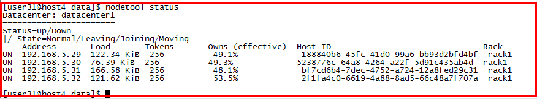

# cassandra集群搭建
## 1.下载cassandra
## 2.准备机器
```
# 统共四台机器,在/etc/hosts中已经将机器ip和机器名进行了映射
host4:作为main主机
host5,host6,host7:这三台机器作为seeds
```
## 3.配置机器,apache-cassandra-3.11.2/conf/cassandra.yaml
### host4
```
- seeds: "host5,host6,host7"
listen_address:host4
rpc_address:host4
rpc_port: 9160
rpc_keepalive: true
```
### host5
```
- seeds: "host5,host6,host7"
listen_address:host5
rpc_address:host5
rpc_port: 9160
rpc_keepalive: true
```
### host6
```
- seeds: "host5,host6,host7"
listen_address:host6
rpc_address:host6
rpc_port: 9160
rpc_keepalive: true
```
### host7
```
- seeds: "host5,host6,host7"
listen_address:host7
rpc_address:host7
rpc_port: 9160
rpc_keepalive: true
```
## 4.删除旧的系统文件,分别在host4-host7执行以下命令,必须要做的操作！！！
```
rm -rf /home/user31/app/apache-cassandra-3.11.2/data/data/system/*
```
## 启动集群
**注意：需要按照顺序启动：首先是seeds主机，最后main主机**
```
# 在host5,host6,host7分别执行
$CASSANDRA_HOME/bin/cassandra
# 最后在host4上执行
$CASSANDRA_HOME/bin/cassandra

# 在main主机上执行
nodetool status
```
