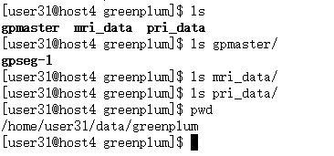
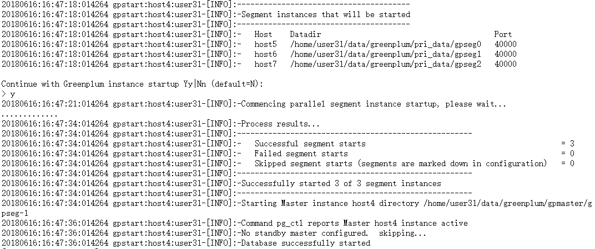

# GreenPlum集群搭建（Installing the Binary Distribution方式）
## 1.Pivotal Greenplum的下载，<a href="https://network.pivotal.io/products/pivotal-gpdb/#/releases/8496">地址</a>
`注册请使用gmail，否则可能下载不了。` 下载版本要适当：Download or copy the Binary Installation distribution file to the master host machine. The Binary Installer distribution filename has the format greenplum-db-<version>-<platform>.zip where <platform> is either RHEL6-x86_64 (Red Hat 64-bit) or SuSE11-x86_64 (SuSe Linux 64 bit).

## 2.解压并赋予greenplum-db-5.2.0-rhel6-x86_64.bin执行权限：
```
chmod 777 greenplum-db-5.2.0-rhel6-x86_64.bin
```

## 3.执行greenplum-db-5.2.0-rhel6-x86_64.bin
```sh
./greenplum-db-5.2.0-rhel6-x86_64.bin
source greenplum_path.sh
```
## 4.建立两个文件，分别指定“主节点+segment”和“segment”,内容如下：
### (1)my_host_list_file
```
host4
host5
host6
host7
```
### (2)seg_hosts
```
host5
host6
host7
```

## 5.添加配置文件
### (1)复制模板
```
cp $GREENPLUM_HOME/docs/cli_help/gpconfigs/gpinitsystem_config  /home/user31/PivotalGreenplum/gpconfigs/gpinitsystem_config
```
### (2)修改模板(完整内容如下)
```sh
# FILE NAME: gpinitsystem_config

# Configuration file needed by the gpinitsystem

################################################
#### REQUIRED PARAMETERS
################################################

#### Name of this Greenplum system enclosed in quotes.
ARRAY_NAME="Greenplum Data Platform"

#### Naming convention for utility-generated data directories.
SEG_PREFIX=gpseg

#### Base number by which primary segment port numbers
#### are calculated.
PORT_BASE=40000

#### File system location(s) where primary segment data directories
#### will be created. The number of locations in the list dictate
#### the number of primary segments that will get created per
#### physical host (if multiple addresses for a host are listed in
#### the hostfile, the number of segments will be spread evenly across
#### the specified interface addresses).
declare -a DATA_DIRECTORY=(/home/user31/data/greenplum/pri_data)

#### OS-configured hostname or IP address of the master host.
MASTER_HOSTNAME=host4

#### File system location where the master data directory
#### will be created.
MASTER_DIRECTORY=/home/user31/data/greenplum/gpmaster

#### Port number for the master instance.
MASTER_PORT=5432

#### Shell utility used to connect to remote hosts.
TRUSTED_SHELL=ssh

#### Maximum log file segments between automatic WAL checkpoints.
CHECK_POINT_SEGMENTS=8

#### Default server-side character set encoding.
ENCODING=UNICODE

################################################
#### OPTIONAL MIRROR PARAMETERS
################################################

#### Base number by which mirror segment port numbers
#### are calculated.
#MIRROR_PORT_BASE=50000

#### Base number by which primary file replication port
#### numbers are calculated.
#REPLICATION_PORT_BASE=41000

#### Base number by which mirror file replication port
#### numbers are calculated.
#MIRROR_REPLICATION_PORT_BASE=51000

#### File system location(s) where mirror segment data directories
#### will be created. The number of mirror locations must equal the
#### number of primary locations as specified in the
#### DATA_DIRECTORY parameter.

declare -a MIRROR_DATA_DIRECTORY=(/home/user31/data/greenplum/mri_data)


################################################
#### OTHER OPTIONAL PARAMETERS
################################################

#### Create a database of this name after initialization.
DATABASE_NAME=tpc_h

#### Specify the location of the host address file here instead of
#### with the the -h option of gpinitsystem.
#MACHINE_LIST_FILE=/home/gpadmin/gpconfigs/hostfile_gpinitsystem
```
## 6.在所有的节点上进行安装
### (1)使用gpseginstall 安装
```
 bin/gpseginstall -f my_host_list_file -u user31
```
### (2) 修改环境变量~/.bash_profile
```sh
export GREENPLUM_HOME=/home/user31/PivotalGreenplum
export MASTER_DATA_DIRECTORY=/home/user31/data/greenplum/gpmaster/gpseg-1

export PATH="$HOME/bin:$HOME/.local/bin:$PYTHON_HOME/bin:$CMAKE_HOME/bin:$JAVA_HOME/bin:$HADOOP_HOME/sbin:$HADOOP_HOME/bin:$HIVE_HOME/bin:$SPARK_HOME/bin:$SPARK_HOME/sbin:$CASSANDRA_HOME/bin:$MYSQL_HOME/bin:$GREENPLUM_HOME/bin:$GREENPLUM_HOME/sbin:$PATH"
```
### (3)安装完成以后进行以下的验证
```
bin/gpssh -f my_host_list_file -e ls -l $GREENPLUM_HOME
```
## 7.建立data路径和文件夹

## 8.对集群进行初始化
```
bin/gpinitsystem -c gpconfigs/gpinitsystem_config -h seg_hosts
```
## 9.启动集群
### (1)执行`gpstart`
### (2)启动成功

## 10.验证
```
psql -U user31 tpc_h
```
