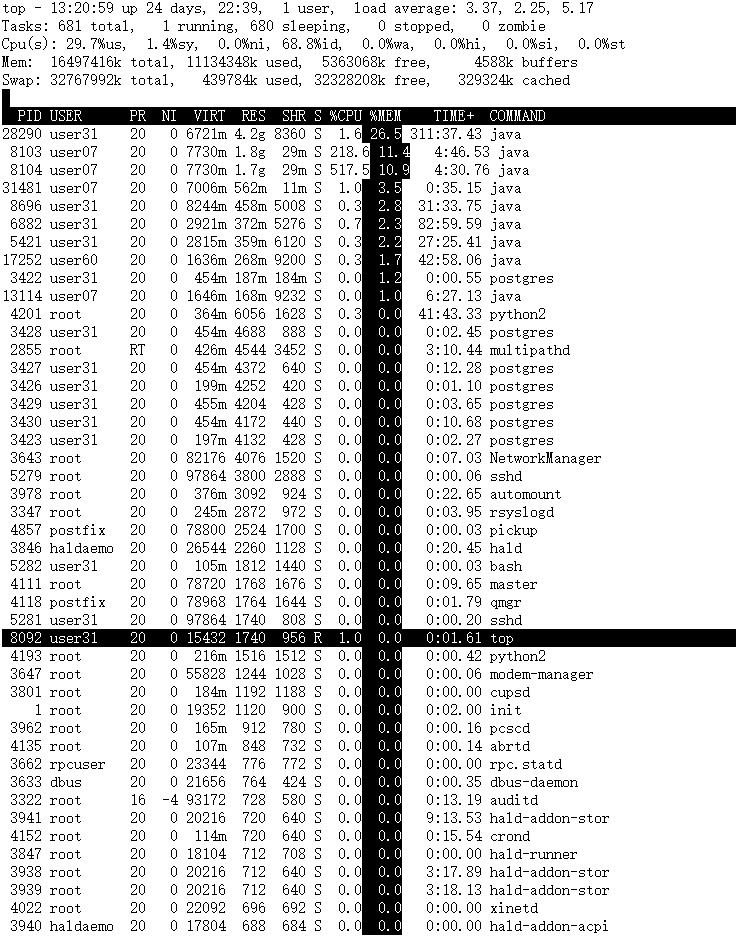

# 查看linux系统及配置常用的命令
## 1.linux cpu大小
```sh
 cat /proc/cpuinfo | grep "model name" && cat /proc/cpuinfo | grep "physical id"
```
结果：
```
model name      : Intel(R) Xeon(R) CPU E5-2620 0 @ 2.00GHz
model name      : Intel(R) Xeon(R) CPU E5-2620 0 @ 2.00GHz
model name      : Intel(R) Xeon(R) CPU E5-2620 0 @ 2.00GHz
model name      : Intel(R) Xeon(R) CPU E5-2620 0 @ 2.00GHz
model name      : Intel(R) Xeon(R) CPU E5-2620 0 @ 2.00GHz
model name      : Intel(R) Xeon(R) CPU E5-2620 0 @ 2.00GHz
model name      : Intel(R) Xeon(R) CPU E5-2620 0 @ 2.00GHz
model name      : Intel(R) Xeon(R) CPU E5-2620 0 @ 2.00GHz
model name      : Intel(R) Xeon(R) CPU E5-2620 0 @ 2.00GHz
model name      : Intel(R) Xeon(R) CPU E5-2620 0 @ 2.00GHz
model name      : Intel(R) Xeon(R) CPU E5-2620 0 @ 2.00GHz
model name      : Intel(R) Xeon(R) CPU E5-2620 0 @ 2.00GHz
model name      : Intel(R) Xeon(R) CPU E5-2620 0 @ 2.00GHz
model name      : Intel(R) Xeon(R) CPU E5-2620 0 @ 2.00GHz
model name      : Intel(R) Xeon(R) CPU E5-2620 0 @ 2.00GHz
model name      : Intel(R) Xeon(R) CPU E5-2620 0 @ 2.00GHz
model name      : Intel(R) Xeon(R) CPU E5-2620 0 @ 2.00GHz
model name      : Intel(R) Xeon(R) CPU E5-2620 0 @ 2.00GHz
model name      : Intel(R) Xeon(R) CPU E5-2620 0 @ 2.00GHz
model name      : Intel(R) Xeon(R) CPU E5-2620 0 @ 2.00GHz
model name      : Intel(R) Xeon(R) CPU E5-2620 0 @ 2.00GHz
model name      : Intel(R) Xeon(R) CPU E5-2620 0 @ 2.00GHz
model name      : Intel(R) Xeon(R) CPU E5-2620 0 @ 2.00GHz
model name      : Intel(R) Xeon(R) CPU E5-2620 0 @ 2.00GHz
physical id     : 0
physical id     : 0
physical id     : 0
physical id     : 0
physical id     : 0
physical id     : 0
physical id     : 1
physical id     : 1
physical id     : 1
physical id     : 1
physical id     : 1
physical id     : 1
physical id     : 0
physical id     : 0
physical id     : 0
physical id     : 0
physical id     : 0
physical id     : 0
physical id     : 1
physical id     : 1
physical id     : 1
physical id     : 1
physical id     : 1
physical id     : 1
```
## 2.内存大小
```sh
cat /proc/meminfo
```
结果：
```
[user31@host4 ~]$ cat /proc/meminfo
MemTotal:       16497416 kB
MemFree:         5204884 kB
Buffers:          125024 kB
Cached:          4192860 kB
SwapCached:        54100 kB
Active:          5786356 kB
Inactive:        4793328 kB
Active(anon):    4944544 kB
Inactive(anon):  1326056 kB
Active(file):     841812 kB
Inactive(file):  3467272 kB
Unevictable:        4540 kB
Mlocked:            4540 kB
SwapTotal:      32767992 kB
SwapFree:       25063164 kB
Dirty:               204 kB
Writeback:             0 kB
AnonPages:       6260252 kB
Mapped:            73872 kB
Shmem:              5316 kB
Slab:             408400 kB
SReclaimable:     311952 kB
SUnreclaim:        96448 kB
KernelStack:       14312 kB
PageTables:        47324 kB
NFS_Unstable:          0 kB
Bounce:                0 kB
WritebackTmp:          0 kB
CommitLimit:    41016700 kB
Committed_AS:   16667748 kB
VmallocTotal:   34359738367 kB
VmallocUsed:      319028 kB
VmallocChunk:   34349441288 kB
HardwareCorrupted:     0 kB
AnonHugePages:   5488640 kB
HugePages_Total:       0
HugePages_Free:        0
HugePages_Rsvd:        0
HugePages_Surp:        0
Hugepagesize:       2048 kB
DirectMap4k:        5528 kB
DirectMap2M:     2058240 kB
DirectMap1G:    14680064 kB
```
## 3.硬盘大小（要有sudo权限）
```
fdisk -l
```
结果：
```

```
## 4.查看内核/操作系统/CPU信息的linux系统信息命令
```sh
uname -a
```
结果：
```
Linux host4 2.6.32-358.el6.x86_64 #1 SMP Tue Jan 29 11:47:41 EST 2013 x86_64 x86_64 x86_64 GNU/Linux
```
## 5.查看操作系统版本，是数字1不是字母L
```
head -n 1 /etc/issue
```
结果：
```
Red Hat Enterprise Linux Server release 6.4 (Santiago)
```
## 6.查看计算机名的linux系统信息命令
```
hostname
```
结果：
```
host4
```
## 7.查看内存使用量和交换区使用量
```
free -m
```
结果：
```
total       used       free     shared    buffers     cached
Mem:         16110       8592       7518          0         69       1189
-/+ buffers/cache:       7332       8778
Swap:        31999       7523      24476
```
## 8.查看各分区使用情况
```
df -h
```
结果：
```
Filesystem            Size  Used Avail Use% Mounted on
/dev/sda3             243G  129G  103G  56% /
tmpfs                 7.9G     0  7.9G   0% /dev/shm
/dev/sda1             485M   39M  422M   9% /boot
```

## 9.top命令
```
(1)按数字键1可以查看cpu
(2)键入字母b高亮开关，键入x高亮列
(3)"shift+>"或者"shift+<"选择列进行排序
```

