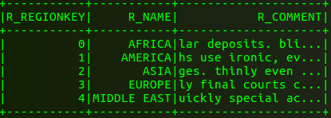

# SparkSQL

## SparkSQL从Mysql加载数据
SparkSQL简单使用
```
start-all.sh
spark-shell --jars /home/mao/Apache/hive-1.2.2/lib/mysql-connector-java-5.1.46-bin.jar
val sqlContext = new org.apache.spark.sql.SQLContext(sc)
val jdbcDF = sqlContext.read.format("jdbc").options(Map("url" -> "jdbc:mysql://localhost:3306/tpch", "driver" -> "com.mysql.jdbc.Driver", "dbtable" -> "region", "user" -> "root", "password" -> "1234")).load()
jdbcDF.show()
```
结果
