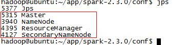
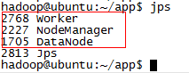
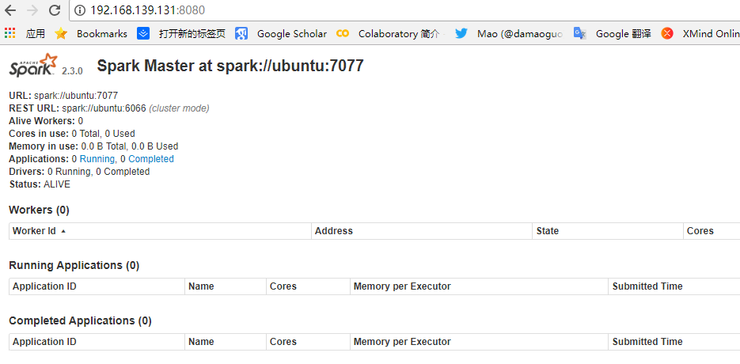

# Spark cluster搭建
1. 将文件上传到每一个节点上
2. 添加环境变量
```
export SPARK_HOME=
```
3. 配置文件修改(conf文件夹下)
```
cp spark-env.sh.template spark-env.sh
export JAVA_HOME=/home/hadoop/app/java/jdk1.8.0_171
export SPARK_WORKER_CORES=8
```
4. scala安装
5. scp环境变量
```
 scp -r /home/hadoop/app/spark-2.3.0/conf node1:/home/hadoop/app/spark-2.3.0
 scp -r /home/hadoop/app/spark-2.3.0/conf node2:/home/hadoop/app/spark-2.3.0
```
6. 使用
```
$SPARK_HOME/sbin/start-all.sh
```
master：
<br>
worker：
<br>
<br>
