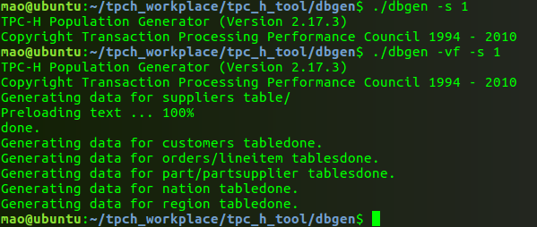

### <a href="http://www.tpc.org/tpc_documents_current_versions/download_programs/tools-download-request.asp?bm_type=TPC-H&bm_vers=2.17.3&mode=CURRENT-ONLY">工具下载TPC-H</a>

### 编译(修改cp makefike.suite makefile)
```
CC      =gcc 
# Current values for DATABASE are: INFORMIX, DB2, TDAT (Teradata)
#                                  SQLSERVER, SYBASE, ORACLE, VECTORWISE
# Current values for MACHINE are:  ATT, DOS, HP, IBM, ICL, MVS, 
#                                  SGI, SUN, U2200, VMS, LINUX, WIN32 
# Current values for WORKLOAD are:  TPCH
DATABASE=ORACLE 
MACHINE =LINUX 
WORKLOAD =TPCH 
#
```
### 结果


### 加载数据
TERMINATED BY '|'